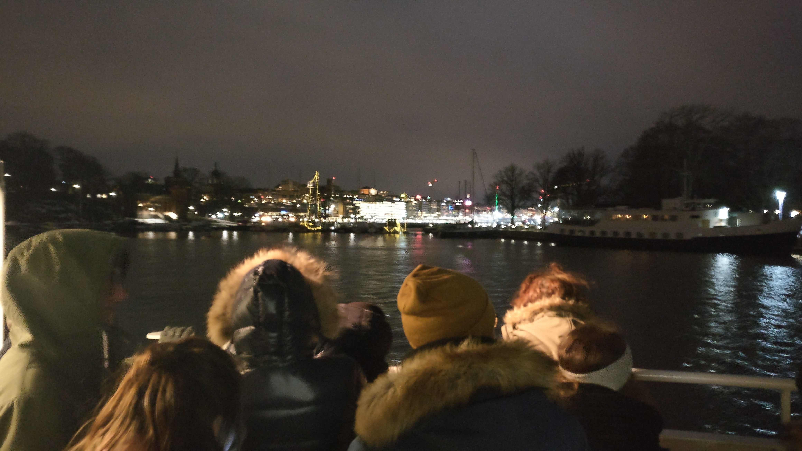

---

title: Weekend-Walk Norrmalm

date: 2019-02-10

published: false

tags: ['travels']

description: "I walk from Gamla Stan to Norrmalm and Djurgården. I end up taking the ferry back to Gamla Stan to grab a snack."

---

If I get food at the restaurant across the office, I pay 10 euros for a good meal. In fact the meal is more than plenty, which makes it so I can split it and eat 2 days from it. That's 5 euros a day and I've already got my big meal of the day.

This weekend I went for a walk in the northern part of Stockholm, Norrmalm. I like to just walk around and take my time. I don't really plan anything that I want to see, I just go to an area and 'explore'.

There are a lot of coffee bars here, and every one of them has a nice assortment of pastries.  

I enjoy sitting here. Yesterday I was translating the company's conversations in Slack, to learn a bit of Swedish. Seems there was a huge bug and bug-fix on Friday. Completely avoided that one since I was so focused on my drag and drop editor.

So today I've been out on my own all day. Walked from Gamla Stan all the way up to Norrmalm, visited some shops and stayed for a bit at a coffee bar, then I walked all the way to Djurgården. They have a lot of museums there. Apparently they all close at 17h, and I was there at 16h50.

But it seems the Nordiska Museet is free on Tuesdays from 13h till 17h, so I guess Tuesday is gonna be museum day. There is also a huge ship which they restored recently, together with a viking museum and an ABBA museum.

My colleagues at work told me I should try the herring. So my plan was to find a restaurant in Gamla Stan and try some fish.

The part where you see me traversing the water is where I took the ferry.  
As I arrived in Gamla Stan, I did come across some good restaurants, but it felt a bit weird going to a fancy restaurant and order fish from 28 euros all on my own.

So I found a cafe which served a meatballs special for 10 euros. That's more my style.
