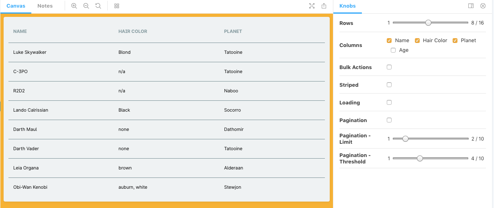

---

title: Table component phase 1

date: 2019-03-15

published: false

tags: ['internship']

description: "Making a Table component out of a UX Designers specs and code reviewing it."

---

We are starting a new style-guide and I'm working on the table component. I have made a first version and I'm displaying it using storybook.

We chose to use native table tags instead of the alternative divs. We were worried that tables were bad at the more complicated stuff, like sticky-ing a header.

The first thing was to take in an array of data, called rows. Then take in an array of objects, to decide what and in what order to render the content. These are the columns.

Our UX designer did a very good job at writing the specs and the designs. After the first meeting we had another more technical meeting to define the api and props.

After our PM wrote the specs, I started making phase 1, which included bulk actions, selecting rows, pagination and a loading state.

When I finished this part, the PM gathered everyone to do a code review. One of our developers was working remote so we set up a Google meeting. I shared my screen and went through my code.

We settled on some minor code improvements, like calling a select that also deselects a toggle, declaring default values as constants in capitals at the top, emitting the pagination events, etc.

In the end its not important what you decide, but that you decide on some rules to promote consistency.

I set up a storybook with the new table component. I checked out some addons and found a knobs addon where you can toggle props.

I'm quite happy with the storybook page.